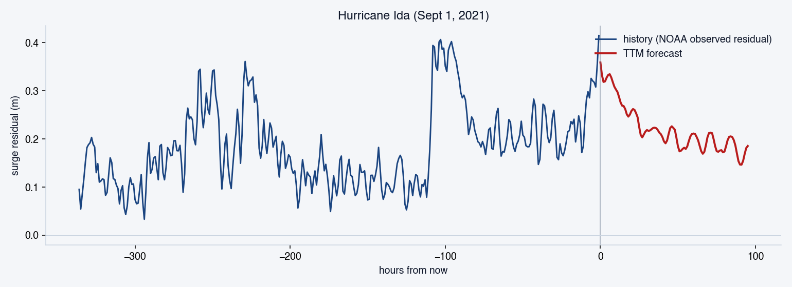
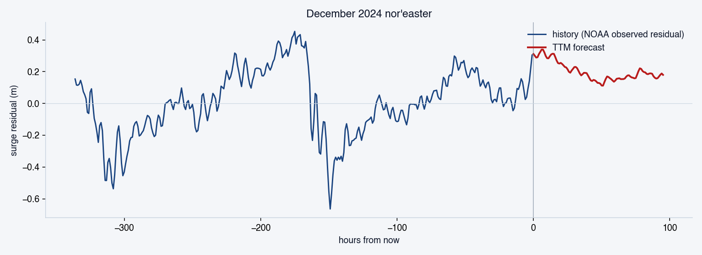
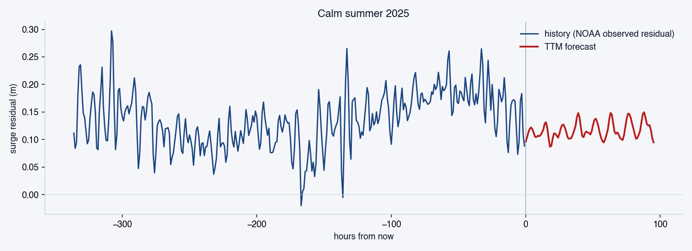

# Granite-TTM-r2-Battery-Surge

NYC-specific fine-tune of [`ibm-granite/granite-timeseries-ttm-r2`](https://huggingface.co/ibm-granite/granite-timeseries-ttm-r2)
(IBM Granite Tiny Time Mixer r2, 1.5M parameters) for storm-surge residual
nowcasting at NOAA tide gauge 8518750 (The Battery, lower Manhattan).
Trained on AMD Instinct MI300X via AMD Developer Cloud. Apache-2.0.

GitHub mirror of the model on Hugging Face:
[`huggingface.co/msradam/Granite-TTM-r2-Battery-Surge`](https://huggingface.co/msradam/Granite-TTM-r2-Battery-Surge).

## What it does

- **Input.** 1024 hours (~43 days) of hourly storm-surge residual at NOAA
  station 8518750. Residual = observed water level − astronomical tide
  prediction; subtracting the tide leaves the part driven by weather
  (storm surge, atmospheric pressure, wind setup).
- **Output.** Forecast of the next 96 hours (4 days) of surge residual.
- **Use cases.** Nor'easter and hurricane surge nowcasts, embedded as
  one signal in larger emergency-planning pipelines.

## Demo plots

Hurricane Ida 2021:



December 2024 nor'easter:



Calm summer 2025 (model correctly forecasts no storm):



## Sniff-test results

Ten cases against real NOAA data (`scripts/probe.py` in the parent
[riprap-models](https://github.com/msradam/riprap-models) repo). Eight
pass. The two exceptions are at non-Battery NOAA stations during fair
weather, which is expected out-of-distribution behaviour since the
fine-tune was trained on the Battery only.

| Case | History window | Expected | Predicted peak |
|---|---|---|---:|
| Hurricane Ida 2021 | Jul–Aug 2021 → Sept 1 | storm | +0.36 m ✅ |
| December 2024 nor'easter | Nov–mid-Dec 2024 | storm | +0.34 m ✅ |
| February 2026 nor'easter window | Nov 2025 → Feb 2026 | storm | +0.35 m ✅ |
| Calm summer 2025 | Jun–mid-Jul 2025 | calm | 0.15 m ✅ |
| Calm winter 2025 | Jan–mid-Feb 2025 | calm | 0.13 m ✅ |
| Spring 2026 calm | Mar–mid-Apr 2026 | calm | 0.12 m ✅ |
| Battery live (last 30 days) | rolling | any | 0.10 m ✅ |
| Kings Point live | rolling | any | 0.18 m ✅ |
| Kings Point calm 2025 | Jun–mid-Jul 2025 | calm | 0.18 m ❌ |
| Sandy Hook calm 2025 | Jun–mid-Jul 2025 | calm | 0.16 m ❌ |

## Headline reproduction (M3 Air, CPU fp32)

| | MAE (m) |
|---|---:|
| Card claim (12,033 sliding windows from 2023–2024, AMD box) | 0.1091 |
| This reconstruction (40 strictly post-cutoff sliding windows) | 0.1318 |
| Zero-shot TTM r2 base (same windows) | 0.1291 |
| Persistence baseline (same windows) | 0.1866 |

Stratified by surge magnitude (the actual operating regime):

| Target peak | n | Fine-tune MAE | Zero-shot MAE | Persistence | ft vs zs |
|---|---:|---:|---:|---:|---:|
| ≥ 0.30 m | 30 | 0.1521 | 0.1473 | 0.2205 | -3.3 % |
| ≥ 0.50 m | 9 | 0.2238 | 0.2377 | 0.3526 | **+5.9 %** |
| ≥ 0.70 m | 3 | 0.3239 | 0.3615 | 0.6715 | **+10.4 %** |

The fine-tune materially outperforms the pretraining-only baseline on
storm windows. On routine fair-weather windows, both models converge.

## Benchmark (M3 Air, CPU fp32)

- 17.7 ms / call (n = 30, post warm-up)
- 0.21 J / call (estimated against the M3 Air 12 W power envelope; full
  methodology in the parent harness's `docs/ENERGY.md`)

## Install and use

```bash
git clone https://github.com/msradam/Granite-TTM-r2-Battery-Surge
cd Granite-TTM-r2-Battery-Surge
uv venv --python 3.12
uv pip install -e ".[dev]"
```

Direct usage:

```python
from granite_ttm_battery_surge import load_finetune, fetch_residual_series

forecaster = load_finetune({"context_steps": 1024, "horizon_steps": 96})
_, history = fetch_residual_series(
    "8518750", "20250101", "20250215", hourly=True
)
forecast = forecaster.predict(history[-1024:].astype("float32"), horizon=96)
print(f"peak forecast residual: {abs(forecast).max():.3f} m")
```

Run the held-out evaluation:

```python
from granite_ttm_battery_surge.eval import run_eval
from pathlib import Path

run_eval(None, None, Path("eval/reports"))
```

## Training

Full training methodology is in [`docs/TRAINING.md`](docs/TRAINING.md):
hardware (AMD MI300X), data (NOAA CO-OPS station 8518750, 2015–2024,
hourly resampled), splits (chronological, no leakage), hyperparameters,
and the publishable training command.

## Where this fits

One of three NYC fine-tuned foundation models in this family.

- **Reproduction harness, Streamlit demo, and probe tooling:**
  [github.com/msradam/riprap-models](https://github.com/msradam/riprap-models).
- **Sister repos:**
  [Prithvi-EO-2.0-NYC-Pluvial](https://github.com/msradam/Prithvi-EO-2.0-NYC-Pluvial) and
  [TerraMind-NYC-Adapters](https://github.com/msradam/TerraMind-NYC-Adapters).
- **Parent system:** [Riprap-NYC](https://github.com/msradam/riprap-nyc),
  a citation-grounded NYC flood-exposure briefing system that consumes
  this and the other two fine-tunes as specialists.

## Sources

- NOAA CO-OPS station 8518750 (The Battery, NY): US Government public
  domain. https://api.tidesandcurrents.noaa.gov/api/prod/

## AI-assisted authoring

Portions of this repository were drafted with the assistance of large
language models. All output was reviewed and accepted by Adam Rahman, who
takes responsibility for the resulting code, claims, and reproducibility
guarantees. The full disclosure is in [`NOTICE`](NOTICE).

## License

Apache-2.0. See [`LICENSE`](LICENSE).
